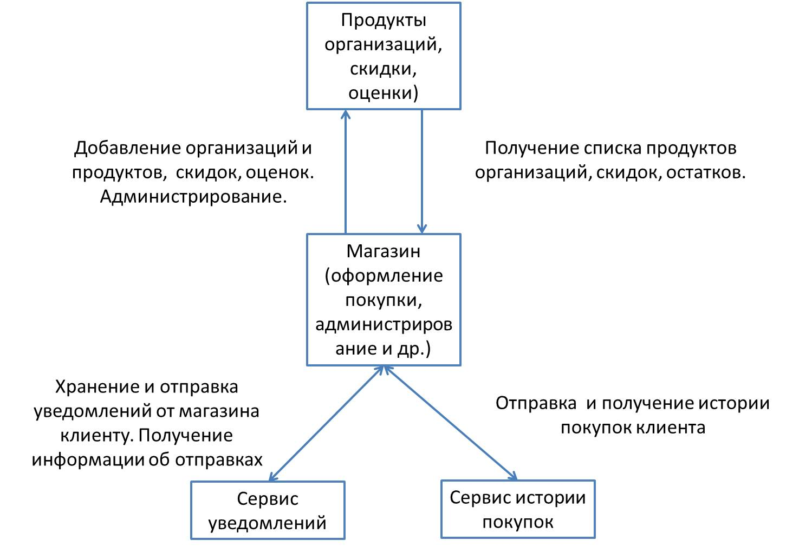

#  Магазин на микросервисах

API простого магазина. Функционал API подразделяется на админский и пользовательский.
В магазине работают следующие правила:
- Функционал админа расширяет весь упомянутый функционал пользователя;
- Админ может добавлять и изменять любую информацию о товарах в магазине;
- Информация о товаре состоит из:
     - Названия;
     - Описания;
     - Организации;
     - Цены;
     - Количества на складе;
     - Информации о скидах;
     - Отзывов;
     - Ключевых слов;
     - Таблицы характеристик;
     - Оценок.
- Для товара или группы товаров админ может добавлять и изменять скидки;
- Информация о скидке состоит из:
     - Задействованных товаров;
     - Объема скидки;
     - Длительности скидки.
- Для того чтобы воспользоваться магазином, пользователь должен быть зарегестрированным и войти в учетную запись;
- Пользователь может покупать товары, оставлять о них отзывы и ставить оценки;
- Каждая покупка должна сохраняться в истории покупок;
- Пользователь может просмотреть свою историю покупок;
- Админ может просмотреть историю покупок любого пользователя;
- Пользователь может совершить возврат в течение суток с момента покупки;
- Пользователь не может оценить или оставить отзыв о товаре, не купив его;
- Информация о пользователе состоит из:
     - Юзернейма;
     - Почты;
     - Пароля;
     - Баланса.
- Админ может пополнять баланс пользователя;
- Админ может просматривать информацию о пользователях, удалять и замораживать их аккаунты;
- Админ может отправлять пользователям уведомления;
- Уведомления состоят из:
     - Заголовка уведомления;
     - Даты уведомления;
     - Текстового содержания уведомления.
- Пользователь может просмотреть свои уведомления
- Пользователь может подать заявку на регистрацию организации;
- Организация дает возможность ее создателю добавлять товары и продавать их в данном магазине;
- Организация состоит из:
     - Имени;
     - Описания
     - Логотипа;
     - Товаров.
- Так как заявка на регистрацию организации добавляется авторизованным пользователем, то получателем выручки является данный пользователь;
- Каждый пользователь может создавать неограниченное количество организаций;
- Пользователи, зарегистрировавшие свою организацию, могут добавлять заявки на регистрацию товаров, и после модерации будут добавлены в общий список товаров;
- При добавлении товара пользователем, он обязан указать, от лица какой организации этот товар поставляется;
- Выручку с покупки товаров, принадлежащих организации, за вычетом комиссии, получает организация. Комиссия произвольная (например, 5%);
- Админ вправе принимать заявки на регистрацию организации, замораживать и удалять активные организации;
- Если организация заморожена или удалена, пользователи не должны видеть товары в списке доступных, однако, у купленных товаров должна сохраняться информация
  об организации. Т.е. даже об удаленных, а точнее забаненных организациях информация должна оставаться.
    <h2>Общая схема микросервиса.</h2>

 Регистрация  
http://localhost:8088/api/auth/signup POST 
{"username": "pustohinae", 
"email": "kich_alex654@mail.ru", 
"password":"j3qq4h7h2v"}

По умолчанию роль - USER

Вход: 
http://localhost:8088/api/auth/signin POST 
{"usernameOrEmail": "pustohinae", 
 "password":"j3qq4h7h2v"} 
или 
{"usernameOrEmail": "kich_alex654@mail.ru", 
"password":"j3qq4h7h2v"}

http://localhost:8088/api/test/str
http://localhost:8088/api/auth/logout